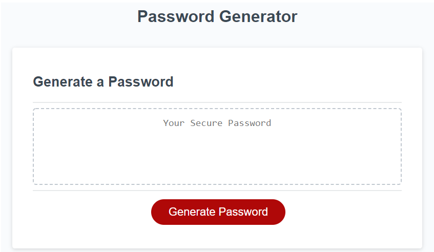

# password-generator

An application that an employee can use to generate a random password based on criteria they’ve selected by modifying starter code. This app will run in the browser, and will feature dynamically updated HTML and CSS powered by JavaScript code. It has a clean and polished user interface that is responsive, ensuring that it adapts to multiple screen sizes.
The password can include special characters

